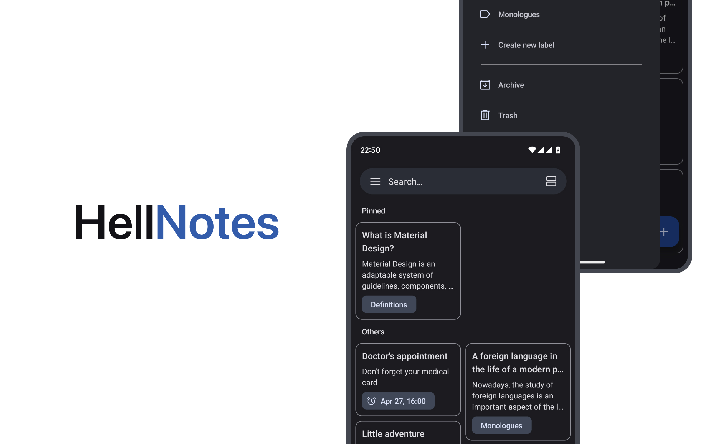

# HellNotes

**HellNotes** is a example of modern notekeeping Android application. Written in Kotlin, using Jetpack Compose UI toolkit. 

## Features

- Create notes, set reminders and add labels.
- Quick access from home screen using [shortcuts](https://developer.android.com/develop/ui/views/launch/shortcuts).
- Using Material You design system.
- Entrance by biometrics and PIN-code lock.
- Private with no data collection and no internet permission at all.

## Technologies

- 100% Kotlin
- Jetpack Compose
- Room
- Dagger Hilt
- Kotlin Coroutines
- Accompanist

## UI

The app was designed using [Material 3 guidelines](https://m3.material.io/). The Screens and UI elements are built entirely using [Jetpack Compose](https://developer.android.com/jetpack/compose). 

The app has two themes: 

- Dynamic color - uses colors based on the [user's current color theme](https://material.io/blog/announcing-material-you) (if supported)
- Default theme - uses predefined colors when dynamic color is not supported

Each theme also supports dark mode. 

## License

**HellNotes** is distributed under the terms of the Apache License (Version 2.0). See the
[license](LICENSE) for more information.
